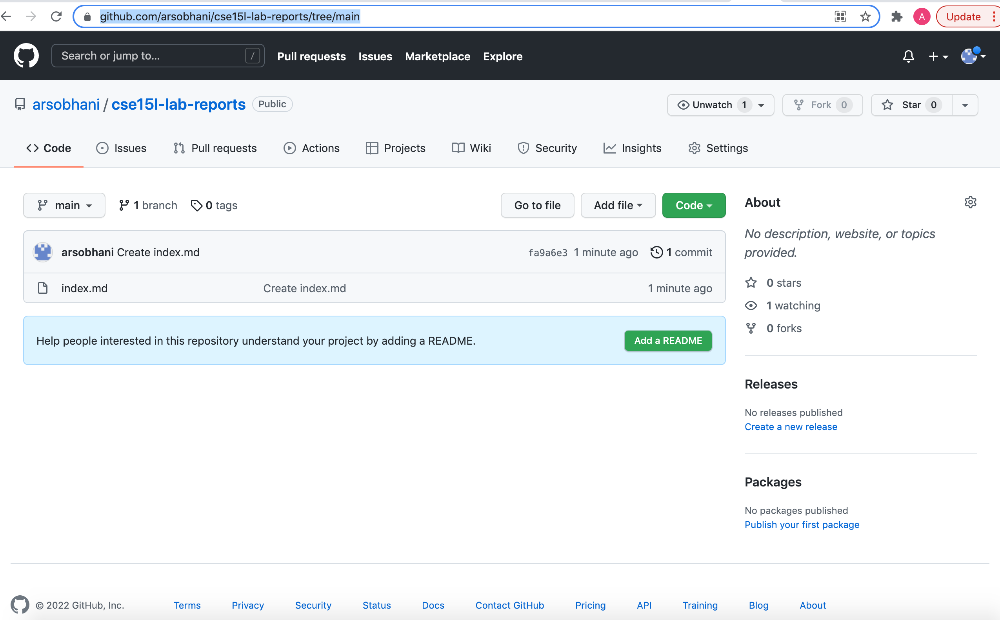

Hello world

Lets try some stuff

# I am  slow at this
## Second heading
*You can italicize stuff with asterisks*

This is for a link
[Lab 2 Doc](https://docs.google.com/document/d/1xUZ61lATlLJgh8sYq6dRILIsnolFmIRXXGGbk9wptb8/edit)
This is for an image


Now...?
>This is blockformatting
It can continue on it seems

* this
* is
* a list

1. numbered list
2. doesnt look much different
3. ok

cant pass through this
- - -


`backtick is near the upper left of the keyboard`

```
Use 3 backticks top and bottom for a block. Above is inline code, btw
```
*Bold* 

**Just kidding its italicized**

[Lab Report 1](lab-report-1-week-2.html)

[Lab Report 2](lab-report-2-week-4.html)

[Lab Report 3](lab-report-3-week-6.html)

[Lab Report 4](lab-report-4-week-8.html)

[Lab Report 5](lab-report-5-week-10.html)




Test screenshot
- - -