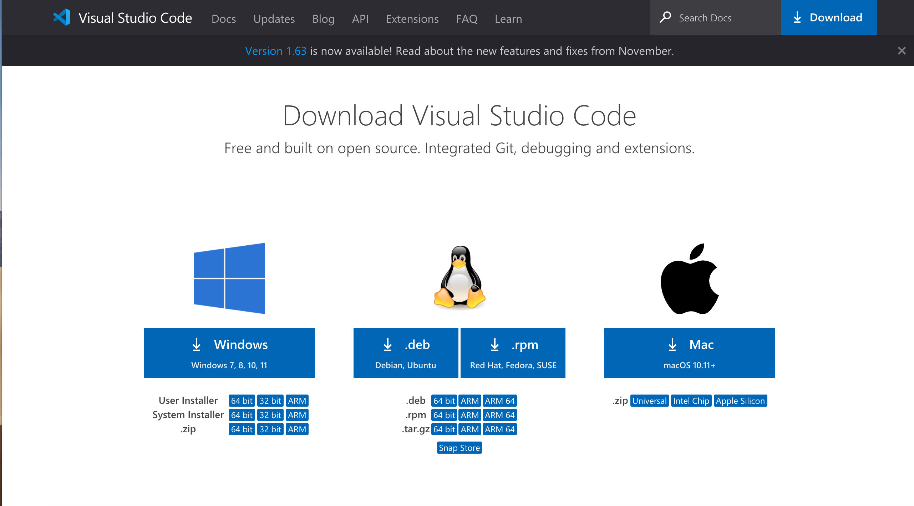
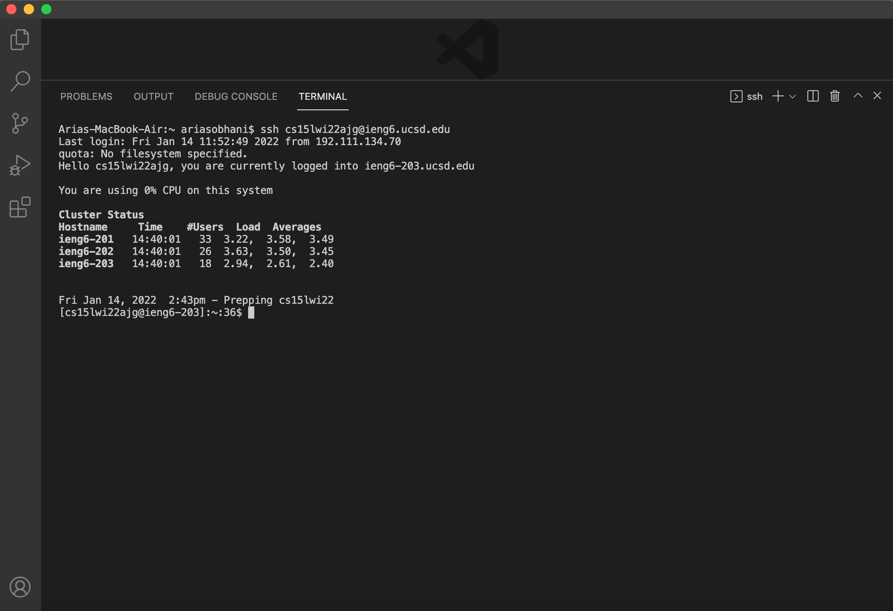
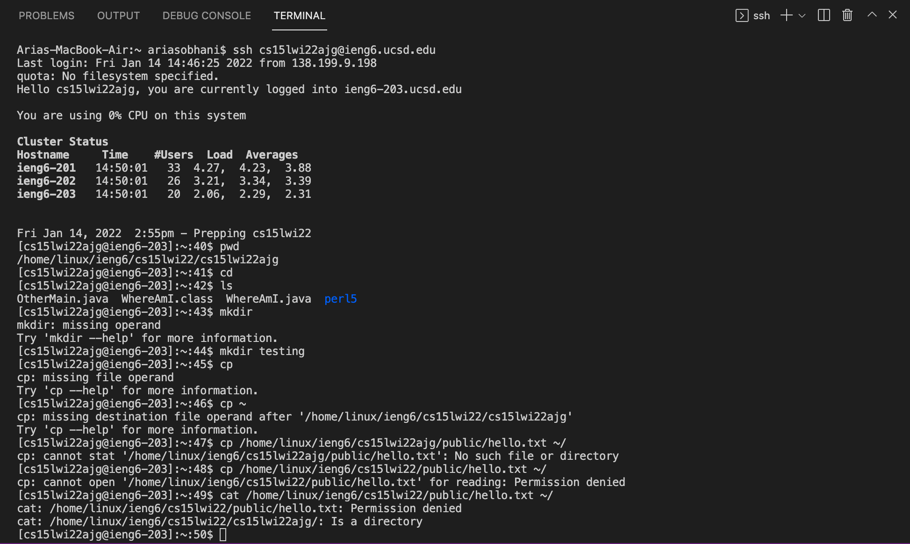
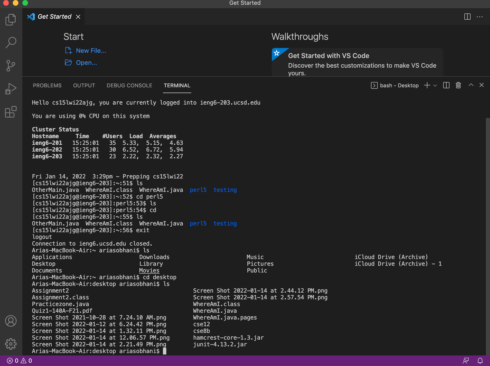
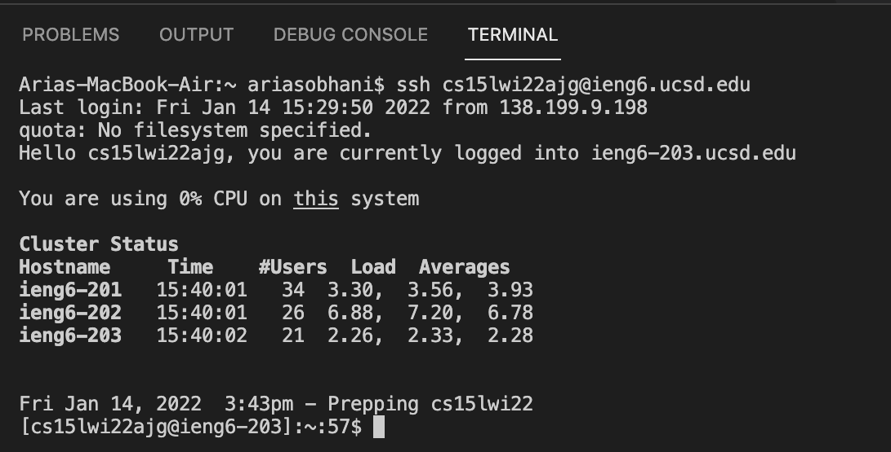
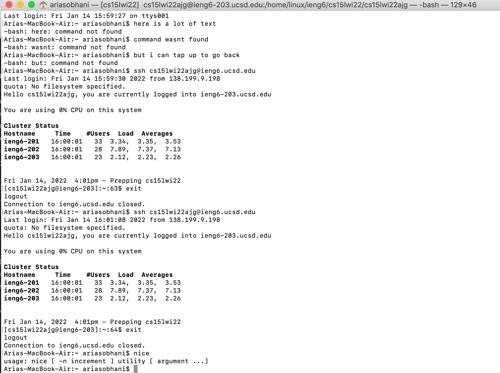

## Week 2 Lab Report

This writup will be about how to log into a course specific account on *ieng6*. You will access a server remotely with your computer, or client.

**Part 1**

The first step is to download VSCode, a useful text editor. Use this [link](https://code.visualstudio.com/) to go to the Visual Studio Code website and download the proper version for the operating system. 

 .

**Part 2**

The next step is to remotely connect to the server. If you use windows, visit [here](https://docs.microsoft.com/en-us/windows-server/administration/openssh/openssh_install_firstuse) and install the program OpenSSH so your computer can connect to other computers.

Next, visit this [link](https://sdacs.ucsd.edu/~icc/index.php) and find your course-specific account for CSE15L through the UCSD site. If need be, make sure to set up your password.

With that information, open up a terminal in VSCode by going to the tab 'Terminal' and creating one. Copy and paste the below code into the terminal, but change the `zz` to the appropriate letters in your course-specific account for CSE15L.

```
ssh cs15lwi22zz@ieng6.ucsd.edu
```

Since it is a new server, it will ask a `(yes/no)`. Select yes and continue to where it asks for a password. You can type in a password, but it will not appear in the terminal, so type precisely.



Now the terminal is connected to a computer in the CSE Basement! To quit, type in `exit` or do **Ctrl-D**.

**Part 3**

Next, we will try running some commands, both on the remote and local terminals for comparison. Try these commands out: `cd`, `ls`, `pwd`, `mkdir`, and `cp`. 



In addition, try these more specific commands:

* `cd ~`
* `cd`
* `ls -lat`
* `ls -a`
* `ls /home/linux/ieng6/cs15lwi22/cs15lwi22abc` where abc is another username
* `cp /home/linux/ieng6/cs15lwi22/public/hello.txt ~/`
* `cat /home/linux/ieng6/cs15lwi22/public/hello.txt`

Again, to quit, type in `exit` or do **Ctrl-D**.

**Part 4**

In this part we will move files with `scp`. With this we can save files to the server.

First, on the client (your computer), create a java file called `WhereAmI.java`, and put the following contents into it:

```
class WhereAmI {
  public static void main(String[] args) {
    System.out.println(System.getProperty("os.name"));
    System.out.println(System.getProperty("user.name"));
    System.out.println(System.getProperty("user.home"));
    System.out.println(System.getProperty("user.dir"));
  }
}
```
Then, open up the terminal and navigate to the directory with this java file. Then enter the following (as usual, changing to your username):

```
scp WhereAmI.java cs15lwi22zz@ieng6.ucsd.edu:~/
```

Enter your **password**, and now it is saved to the server! If you long into *ieng6* with *ssh* again, then enter `ls`, you can see the file you saved.



**Part 5**

Since entering the password repeatedly to access the server can be tedious, we will now use *SSH keys* to facilitate the process.

*SSH Keys* create a private key for the client and a public key for the server. Run this in order to set it up:

```
# on client (your computer)
$ ssh-keygen
Generating public/private rsa key pair.
Enter file in which to save the key (/Users/joe/.ssh/id_rsa): /Users/joe/.ssh/id_rsa
Enter passphrase (empty for no passphrase): 
Enter same passphrase again: 
Your identification has been saved in /Users/joe/.ssh/id_rsa.
Your public key has been saved in /Users/joe/.ssh/id_rsa.pub.
The key fingerprint is:
SHA256:jZaZH6fI8E2I1D35hnvGeBePQ4ELOf2Ge+G0XknoXp0 joe@Joes-Mac-mini.local
The key's randomart image is:
+---[RSA 3072]----+
|                 |
|       . . + .   |
|      . . B o .  |
|     . . B * +.. |
|      o S = *.B. |
|       = = O.*.*+|
|        + * *.BE+|
|           +.+.o |
|             ..  |
+----[SHA256]-----+
```

If on windows, follow the extra steps here:
[Link to extra steps](https://docs.microsoft.com/en-us/windows-server/administration/openssh/openssh_keymanagement#user-key-generation)

In doing this, two files have been created:
one for the private key (in a file `id_rsa`) and one for the public key (in a file `id_rsa.pub`), stored in the `.ssh` directory on your computer.

Now, we copy the public key to the *.ssh* directory of your user account on the server. Follow these steps:

```
$ ssh cs15lwi22zz@ieng6.ucsd.edu
<Enter Password>
# now on server
$ mkdir .ssh
$ <logout>
# back on client
$ scp /Users/joe/.ssh/id_rsa.pub cs15lwi22@ieng6.ucsd.edu:~/.ssh/authorized_keys
# You use your username and the path you saw in the command above
```

Now, we can use *ssh* and *scp* on this client without need of entering the password!



**Part 6 (Final)**

Ideally, we want to make changes to files on local systems and save them on the server as efficiently as possible. Here are a few tricks to help optimize remote running:

If a command is written in quotes at the end of an **ssh** command, the command will execute in the server and then exit.

```
$ ssh cs15lwi22@ieng6.ucsd.edu "ls"
```

You can use semicolons to have multiple commands in one line.

```
$ cp WhereAmI.java OtherMain.java; javac OtherMain.java; java WhereAmI
```

And the one which can really save on time,

## Using the up key to scroll through previous commands!



Conclude Lab report week 2
