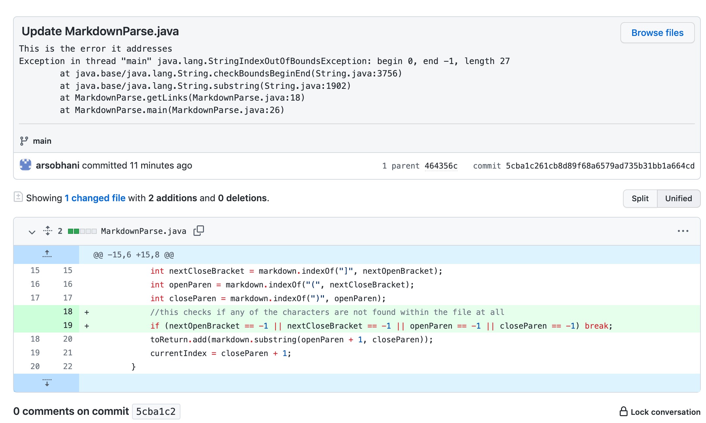
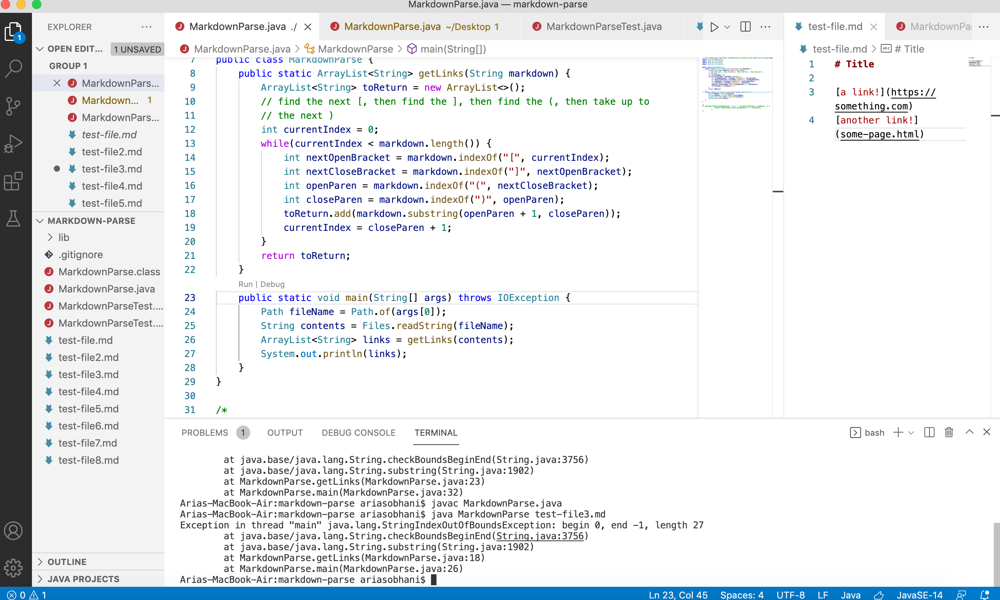
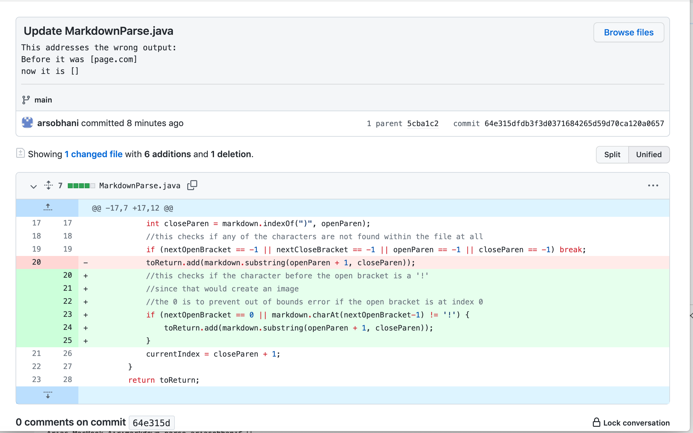
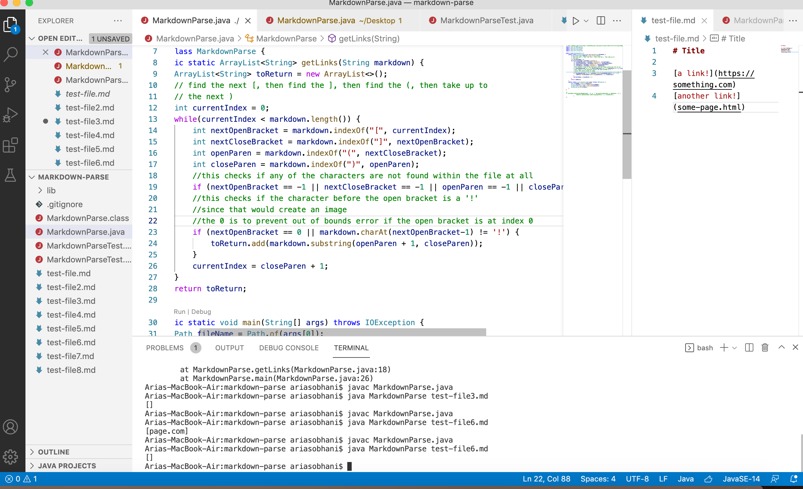
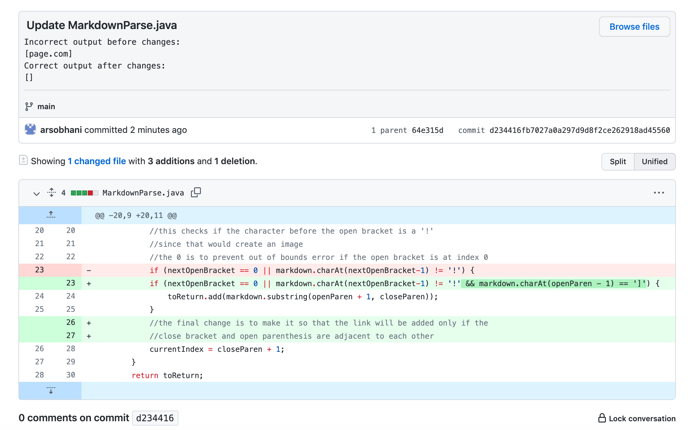
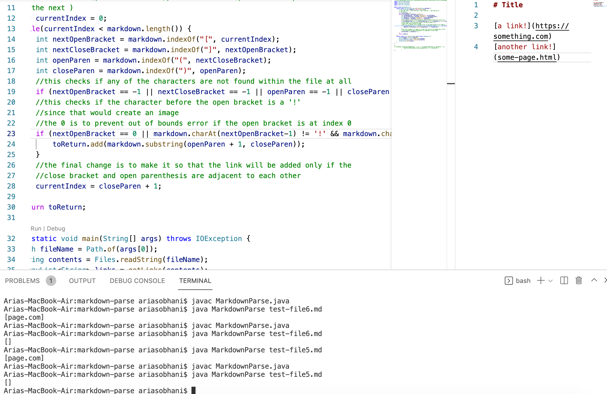

## Week 4 Lab Report

This report will cover 3 changes made to address the bugs in MarkDownParse.java

**First code change:**

This [test file 3](https://github.com/arsobhani/markdown-parse/blob/main/test-file3.md) is the first failure inducing input that caused changes to be made to the original MarkDownParse file.

This is the symptom of the bug:

With the original file, test file 3 indicated that if the input is missing any of the 4 specified characters, it will throw an error. To address this, we put a condition that if the index value for any of those 4 characters remains (-1), the loop will break and nothing will be added to the final array.

**Second code change:**

This [test file 6](https://github.com/arsobhani/markdown-parse/blob/main/test-file6.md) is the second failure inducing input that caused the changes to be made to the MarkDownParse file.

This is the symptom of the bug:

With the edited once file, test file 6 indicated that if the input has an exclamation point before the open bracket, the link will still be added to the array, even though it is for an image. This goes against the intention of the class as it is supposed to only include links. 

**Third code change:**

This [test file 5](https://github.com/arsobhani/markdown-parse/blob/main/test-file5.md) is the third failure inducing input caused the changes to be made to the MarkDownParse file.

This is the symptom of the bug:

With the edited twice file, test file 5 indicated that if the input has text or characters in between the close bracket and open parenthesis, the link will still be added to the array. This goes against the intention of the class as this test case would not be a proper link in the *MarkDown* file format.

