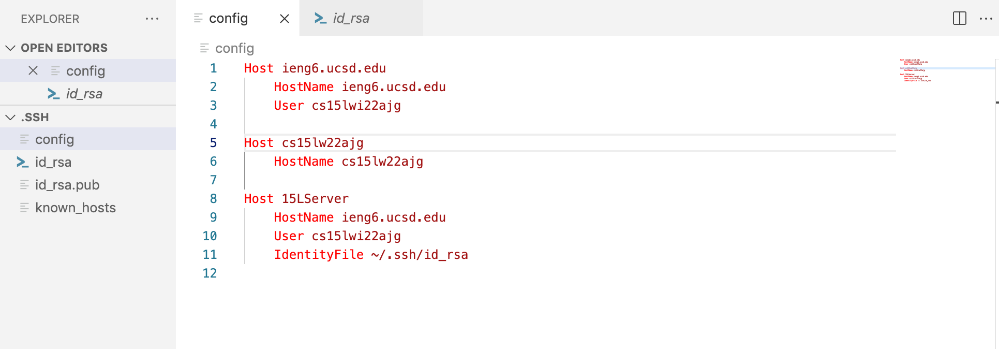
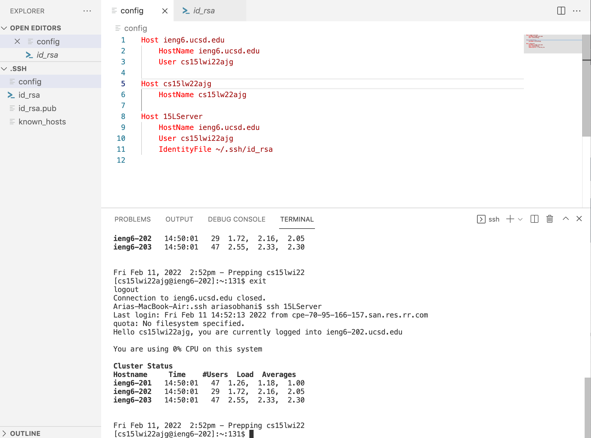
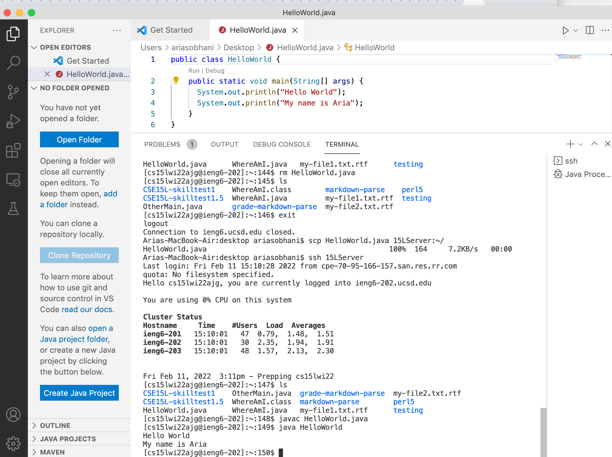

## Lab Report 3 

The header takes you to the index page, but here is a separate link for [index](index.html).

This is for choice #1.

Here is the .ssh/config file.

In order to access the .ssh folder, I had to do `Command + Shift + .(period)`. This is for Mac.
This brings up the private files and folders in addition to the public ones. Then I added the respective text for the *ssh* alias in **config**.

Here is the *ssh* command logging me into **ieng6** using the new alias.

Here is the *scp* command copying a java file into the **ieng6** directory using the new alias.

I also compiled and ran the file in **ieng6**.

