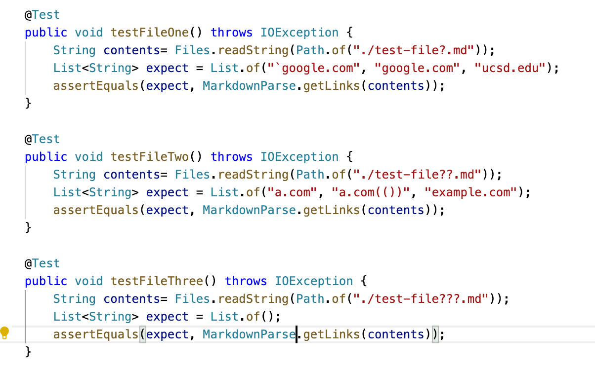
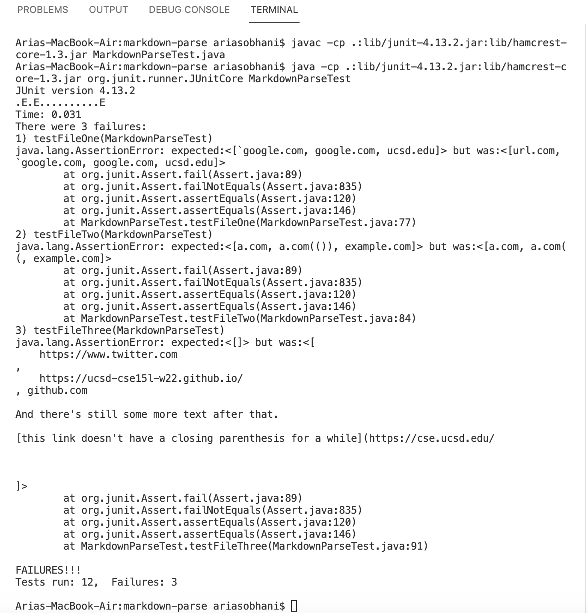
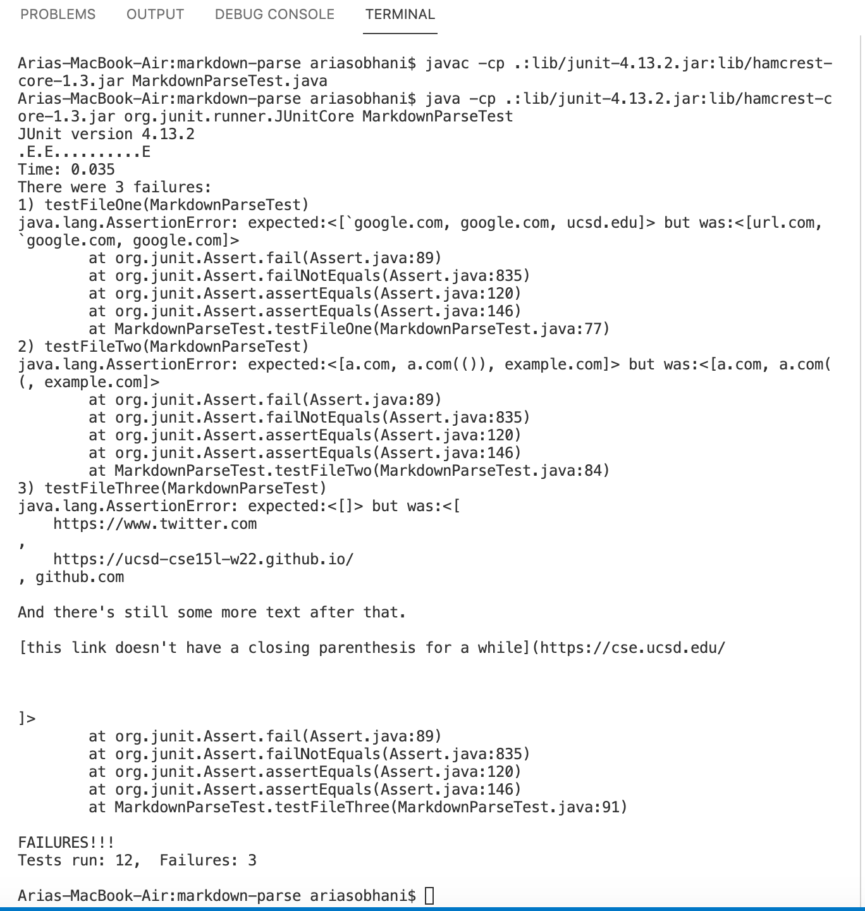

## Lab Report 4 

Here is the link to my group's repository - [mine](https://github.com/arsobhani/markdown-parse).

Here is the link to the reviewed repository - [theirs](https://github.com/JessalynWang/markdown-parse).

For snippet 1, it should look like this:

`[a link`](url.com)

[another link](`google.com)`

[`cod[e`](google.com)

[`code]`](ucsd.edu)

3 Links

---

For snippet 2, it should look like this:

[a [nested link](a.com)](b.com)

[a nested parenthesized url](a.com(()))

[some escaped \[ brackets \]](example.com)

3 Links

---

For snippet 3, it should look like this:

[this title text is really long and takes up more than 
one line

and has some line breaks](
    https://www.twitter.com
)

[this title text is really long and takes up more than 
one line](
    https://ucsd-cse15l-w22.github
    io/
)

[this link doesn't have a closing parenthesis](github.com

And there's still some more text after that.

[this link doesn't have a closing parenthesis for a while](https://cse.ucsd.edu/

)

And then there's more text

3 Links

---

This is how I ran the tests:

For my implementation, none of the tests passed. Here are the results:

For their implementation, none of the tests passed. Here are the results:

**Answers to Questions**

**Snippet 1**

For snippet 1, with the backticks, I believe a solution can be reached by checking if an unpaired backtick occurs right before the open bracket. It seems that if there are multiple lines between the unpaired backtick and the open bracket, the unpaired backtick loses its value, so just check if it occurs right before the open bracket. Also, check if there is an unpaired backtick in the brackets, as that messes it up too. 

**Snippet 2**

This one seems very complicated. There are many possibilities here for where the open bracket and parenthesis and repeated brackets and parenthesis could appear. Perhaps the way you could go about it would be to make sure every parenthesis and bracket are paired before checking for the outermost ones. If there are nested links, it seems that it should not process the outer link and only the inner. There are probably more possibilites than the one listed in the snippet.

**Snippet 3**
I believe a 10 line or less solution could be reached with this one as it is just a check for more than 1 newline in the brackets or parenthesis (I'm not exactly sure how many newlines are permitted, or if even just one newline is considered a newline through vscode). To code for this check shouldn't bee too complicated, I think.