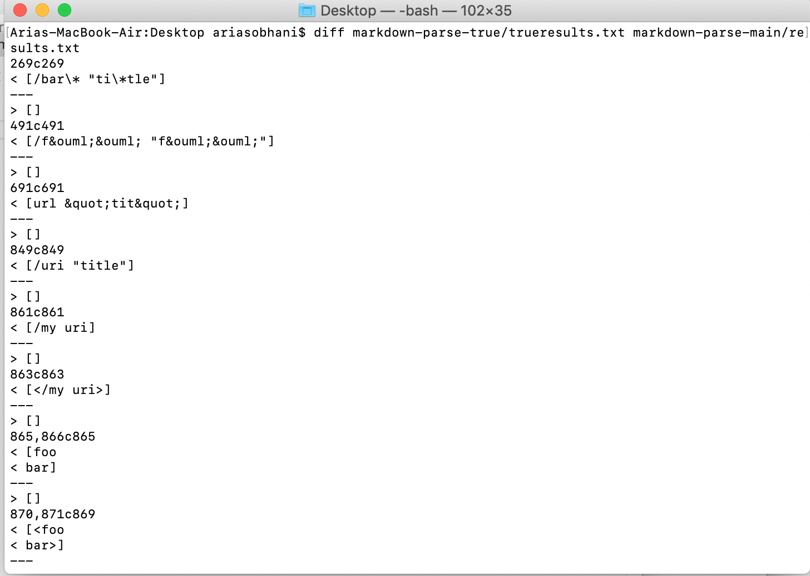
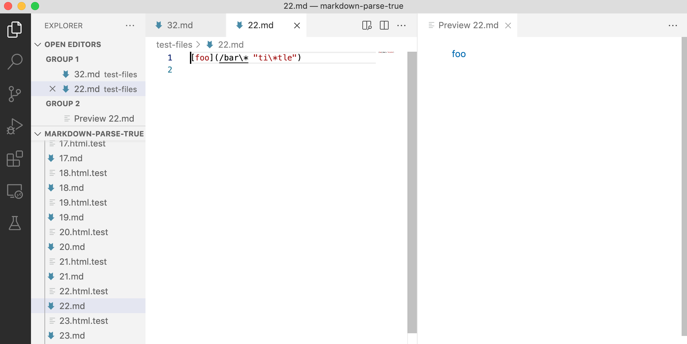
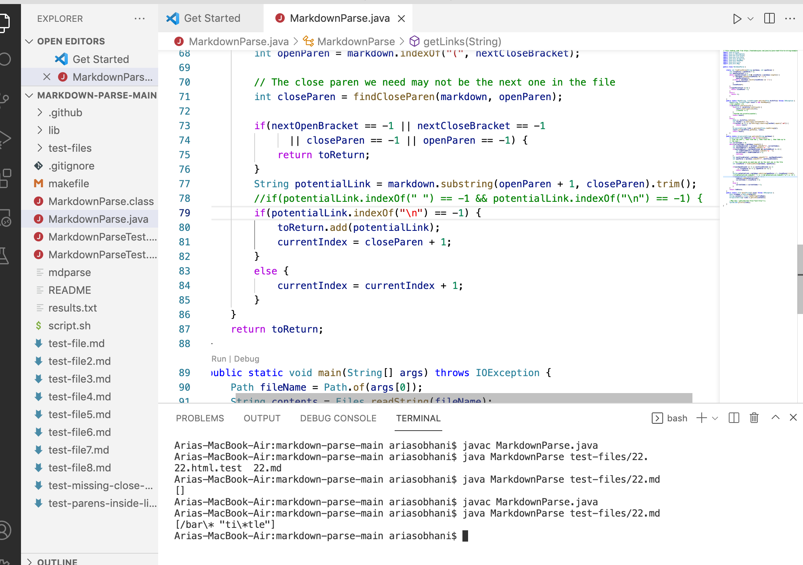
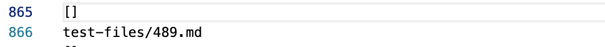
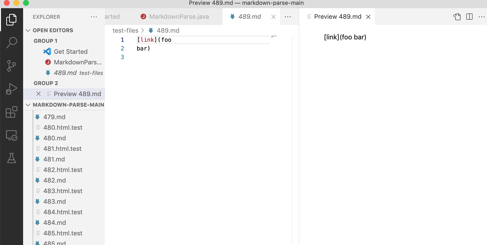

## Lab Report 5

For this lab report I will choose 2 tests in which the implementation of Joe's differs from mine.

Here I will test to see the differences between lines 269 and 865 of the `results.txt` to which the implementations outputted to. It can be seen that I used `diff` on the terminal to determine the differences between the outputs:



**First test at line 269:**

The output by Joe's implementation was:
```
[]
```
My output was:
```
[/bar\* "ti\*tle"]
```

These correspond to test file 22. In the `results.txt`, the bash script prints out the corresponding test, so I just read off that.


Since the test does evaluate to a valid link:



The error lies in Joe's implementation. 

The error here is that Joe's code does not register what is within the parenthesis as a link. After looking through his code, I believe the bug is that the link does not register if there is a `space` character in the middle of the link. There is a trim function which removes the spaces on the outside, but not on the inside. If there is a space inside, the link won't be added, which explains the difference in our results.




**Second test at line 865:**

The output by Joe's implementation was:
```
[]
```
My output was:
```
[foo
bar]
```

Checking once again, these correspond to test file 489.



Since the test does NOT evaluate to a valid link:



The error lies in my implementation.

The error here is that my code registers what is within the open and closed parenthesis as a link, though with *Markdown* it is NOT considered a link. In Joe's code, there is a check to see if there is a `\n` character in the parenthesis, which is a newline input. If it exists, the link is not added, which is correct. However, my code does not have that check, and since this test had a newline within the parenthesis, my code returned it as if it were a valid link.